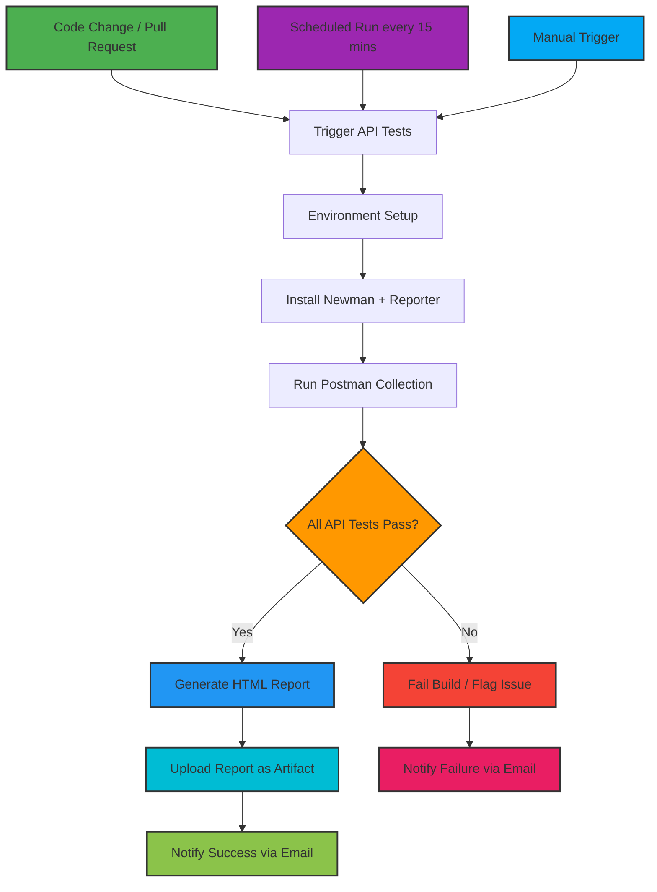

# 🧪 RESTful Booker API - Automated Testing Framework

This project focuses on automated testing of the RESTful Booker API, which provides endpoints for authentication, booking management (CRUD), and health checks.


### About the API

This project uses the **RESTful Booker API** as the target for automated testing and validation.  
The API provides endpoints for **authentication**, **booking management (CRUD operations)**, and **health checks**.  
All endpoints and request/response structures are documented at [RESTful Booker API Documentation](https://restful-booker.herokuapp.com/apidoc/index.html#api-Booking-PartialUpdateBooking).  

---
### 🎯 STAR METHOD - PROJECT STORY

#### **Situation**
The **RESTful Booker API** required robust automated testing coverage across all endpoints — including **authentication**, **booking management**, and **health checks**.  

---

#### **Task**
Design and implement a **complete automated testing framework** that:

- ✅ Covers **API endpoints** documented in the official specification  
- ✅ Validates **positive and negative** scenarios  
- ✅ Performs **security testing** for vulnerabilities  
- ✅ Integrates with **CI/CD pipelines** for continuous assurance  
- ✅ Generates **comprehensive reports** for visibility and tracking  

---

#### **Action**

##### **1. Test Strategy Design**
- Analyzed official API documentation for all endpoints: **Auth**, **Booking CRUD**, **HealthCheck**
- Designed detailed scenarios for **functional**, **integration**, and **security** testing  
- Structured organized **Postman collections** with categorized folders  

##### **2. Comprehensive Test Implementation**
- **Authentication:** Token generation, invalid credentials, and header validation  
- **Booking Management:** Full **CRUD** workflows with request/response validation  
- **Integration Testing:** End-to-end data consistency and dependency coverage  
- **Security Testing:** SQL injection, XSS, and invalid input attempts  
- **Edge Cases:** Missing fields, boundary values, and incorrect data types  

##### **3. CI/CD Automation**
- Built **GitHub Actions** workflow with multiple triggers  
- Scheduled **daily test execution** for API health monitoring  
- Implemented **HTML and JSON reporting** for test visualization   

---

## 🧩 TEST STRATEGY & DOCUMENTATION ALIGNMENT

### ✅ API Endpoints Coverage (100%)

| Endpoint | Method | Test Scenarios | Status |
|-----------|---------|----------------|---------|
| `/auth` | POST | 12 – Token, security, invalid creds | ✅ Complete |
| `/booking` | GET | 8 – Filtering, pagination | ✅ Complete |
| `/booking/{id}` | GET | 7 – Retrieval, formats | ✅ Complete |
| `/booking` | POST | 25 – Creation, validation | ✅ Complete |
| `/booking/{id}` | PUT | 12 – Updates, auth | ✅ Complete |
| `/booking/{id}` | PATCH | 5 – Partial updates | ✅ Complete |
| `/booking/{id}` | DELETE | 8 – Deletion, auth | ✅ Complete |
| `/ping` | GET | 4 – Health checks | ✅ Complete |

---

## 📊 TEST CASE REPORT - DOCUMENTATION VERIFICATION

# API Testing Results Summary

## 📊 Test Overview
- **Total Requests:** 87  
 
---

## 📋 Test Cases and Results

---

## 🔐 AUTHENTICATION

| Test Scenario            | Expected Result            | Actual Result                         | Status | Notes / Bugs |
|-------------------------|----------------------------|----------------------------------------|--------|--------------|
| Valid credentials       | 200 OK with token          | ✅ 200 OK with token                    | PASS   | -            |
| Invalid username        | 401 Unauthorized           | ❌ 200 OK with "Bad credentials"        | FAIL   | **BUG:** Should return 401 |
| Invalid password        | 401 Unauthorized           | ❌ 200 OK with "Bad credentials"        | FAIL   | **BUG:** Should return 401 |
| Missing username        | 400 Bad Request            | ❌ 200 OK with "Bad credentials"        | FAIL   | **BUG:** Should return 400 |
| Missing password        | 400 Bad Request            | ❌ 200 OK with "Bad credentials"        | FAIL   | **BUG:** Should return 400 |
| Empty credentials       | 400 Bad Request            | ❌ 200 OK with "Bad credentials"        | FAIL   | **BUG:** Should return 400 |
| SQL injection attempt   | 400 Bad Request            | ❌ 200 OK with "Bad credentials"        | FAIL   | **BUG:** Security risk → should return 400 |
| XSS attempt             | 400 Bad Request            | ❌ 200 OK with "Bad credentials"        | FAIL   | **BUG:** Security risk → should return 400 |
| Very long credentials   | 400 Bad Request            | ✅ 400 Bad Request                      | PASS   | -            |
| Special characters      | 401 Unauthorized           | ❌ 200 OK with "Bad credentials"        | FAIL   | **BUG:** Should return 401 |
| Numeric credentials     | 401 Unauthorized           | ❌ 200 OK with "Bad credentials"        | FAIL   | **BUG:** Should return 401 |
| Wrong Content-Type      | 400 Bad Request            | ✅ 400 Bad Request                      | PASS   | -            |

🚨 Critical Issues Identified
API always returns HTTP 200 even for errors
No distinction between authentication failures and validation errors
Security threats not properly handled
Poor error response design

---

## 🩺 HEALTH CHECK
| Test Scenario | Expected Result | Actual Result | Status | Notes/Bugs |
|--------------|----------------|----------------|--------|-------------|
| Ping endpoint | 201 Created | ✅ 201 Created | PASS | - |
| Verify response content | "Created" text | ✅ "Created" text | PASS | - |
| Verify headers | Proper headers | ✅ Proper headers | PASS | - |

---

## 📖 BOOKING - GET IDs
| Test Scenario | Expected Result | Actual Result | Status | Notes/Bugs |
|--------------|----------------|----------------|--------|-------------|
| Get all booking IDs | 200 OK with array | ✅ 200 OK with array | PASS | - |
| Search by firstname | 200 OK with filtered results | ✅ 200 OK | PASS | - |
| Search by lastname | 200 OK with filtered results | ✅ 200 OK | PASS | - |
| Search by checkin date | 200 OK with filtered results | ✅ 200 OK | PASS | - |
| Search by checkout date | 200 OK with filtered results | ✅ 200 OK | PASS | - |
| Multiple search params | 200 OK with results | ✅ 200 OK (empty array) | PASS | - |
| Non-existent filters | 200 OK (empty array) | ✅ 200 OK (empty array) | PASS | - |
| Malformed date | 400 Bad Request | ❌ 500 Internal Server Error | **FAIL** | **BUG:** Should handle date parsing properly |

---

## 📋 BOOKING - GET
| Test Scenario | Expected Result | Actual Result | Status | Notes/Bugs |
|--------------|----------------|----------------|--------|-------------|
| Get existing booking | 200 OK with booking data | ❌ 404 Not Found | **FAIL** | **BUG:** Booking ID 970 not found |
| Get invalid ID | 404 Not Found | ✅ 404 Not Found | PASS | - |
| Decimal ID | 400 Bad Request | ✅ 200 OK | PASS | **BUG:** Should validate ID format |
| JSON format | 200 OK JSON | ✅ 200 OK JSON | PASS | - |
| XML format | 200 OK XML | ❌ 404 Not Found | **FAIL** | **BUG:** XML not supported |

---

## ➕ BOOKING - CREATE
| Test Scenario | Expected Result | Actual Result | Status | Notes/Bugs |
|--------------|----------------|----------------|--------|-------------|
| Complete booking data | 200 OK with booking ID | ✅ 200 OK | PASS | - |
| Missing First Name | 400 Bad Request | 400 | PASS | - |
| Missing Last Name | 400 Bad Request | 400 | PASS | - |
| Missing Total Price | 400 Bad Request | 400 | PASS | - |
| Missing Deposit Paid | 400 Bad Request | 400 | PASS | - |
| Missing Booking Dates | 400 Bad Request | 400 | PASS | - |
| Missing Checkin Date | 400 Bad Request | 400 | PASS | - |
| Missing Checkout Date | 400 Bad Request | 400 | PASS | - |
| Empty string fields | 400 Bad Request | ✅ 200 OK | PASS | **BUG:** Empty fields should not be accepted |
| Null field values | 400 Bad Request | ❌ 500 Internal Server Error | **FAIL** | - |
| Special chars in names | 200 OK | ✅ 200 OK | PASS | - |
| Numbers as names | 200 OK | ✅ 200 OK | PASS | - |
| Extremely long strings | 400 Bad Request | ✅ 400 Bad Request | PASS | - |
| Total price = 0 | 200 OK | ✅ 200 OK | PASS | - |
| Negative total price | 400 Bad Request | ✅ 200 OK | PASS | **BUG:** Negative values accepted |
| Decimal price | 200 OK | ✅ 200 OK (truncated) | PASS | - |
| Very large number | 200 OK | ✅ 200 OK | PASS | - |
| Boolean false | 200 OK | ✅ 200 OK | PASS | - |
| Wrong date format | 400 Bad Request | ✅ 200 OK (reformatted) | PASS | **BUG:** Should reject invalid format |
| Invalid date range | 400 Bad Request | ✅ 200 OK | PASS | **BUG:** Date logic missing |
| Historical dates | 200 OK | ✅ 200 OK | PASS | - |
| XML content type | 200 OK | ❌ 500 Internal Server Error | **FAIL** | **BUG:** XML support broken |

---

## ✏️ BOOKING - UPDATE
| Test Scenario | Expected Result | Actual Result | Status | Notes/Bugs |
|--------------|----------------|----------------|--------|-------------|
| Valid update with token | 200 OK | ✅ 200 OK | PASS | - |
| No authentication | 403 Forbidden | ✅ 403 Forbidden | PASS | - |
| Wrong token | 403 Forbidden | ✅ 403 Forbidden | PASS | - |
| Update invalid ID | 404 Not Found | 404 | PASS | - |
| PUT with partial data | 200 OK | ✅ 200 OK | PASS | - |

---

## 🔄 BOOKING - PARTIAL UPDATE
| Test Scenario | Expected Result | Actual Result | Status | Notes/Bugs |
|--------------|----------------|----------------|--------|-------------|
| PATCH with firstname | 200 OK | ✅ 200 OK | PASS | - |
| PATCH with lastname | 200 OK | ✅ 200 OK | PASS | - |
| PATCH with needs | 200 OK | ✅ 200 OK | PASS | - |

---

## 🗑️ BOOKING - DELETE
| Test Scenario | Expected Result | Actual Result | Status | Notes/Bugs |
|--------------|----------------|----------------|--------|-------------|
| Valid delete | 200 OK | ❌ 403 Forbidden | **FAIL** | **BUG:** Auth broken |
| Basic authentication | 200 OK | ❌ 403 Forbidden | **FAIL** | - |
| No authentication | 403 Forbidden | ✅ 403 Forbidden | PASS | - |
| Invalid booking ID | 404 Not Found | ❌ 403 Forbidden | **FAIL** | Wrong status |

---

## 🔗 INTEGRATION TESTS
| Test Scenario | Expected Result | Actual Result | Status | Notes/Bugs |
|--------------|----------------|----------------|--------|-------------|
| End-to-end workflow | All steps successful |  All steps successful | PASS | - |
| Partial update flow | All steps successful |  All steps successful | PASS | - |
| Delete workflow | Create + delete successful |  All steps successful | PASS | - |

---

## 🛡️ SECURITY TESTS
| Test Scenario | Expected Result | Actual Result | Status | Notes/Bugs |
|--------------|----------------|----------------|--------|-------------|
| Access without auth | 403 Forbidden | ✅ 403 Forbidden | PASS | - |
| Malicious input | 400 Bad Request | ❌ 200 OK | FAIL | BUG: Should reject malicious input |
| Malformed JSON | 400 Bad Request | ❌ 200 OK (null price) | FAIL | **BUG:** Should reject invalid JSON |
  

---

**Note:**  
The API shows basic functionality but requires major fixes in authentication, validation, and error handling before production readiness.


---
## 🛠 Tools, Test Data & Known Issues

### **Tools & Frameworks**
| Tool / Framework | Version | Purpose |
|-----------------|---------|---------|
| **Postman** | 10.23.1 | API request design, execution, and collection management |
| **Newman** | 6.24.1 | CLI runner for executing Postman collections in CI/CD |
| **GitHub Actions** | N/A | CI/CD automation for scheduled and PR-triggered test runs |
| **Node.js** | 20.x | Environment for running Newman tests |
| **JSON Schema Validator** | 2.3.0 | Response payload validation against API contract |

### **Sample Test Data / Payloads**

**1. Authentication - CreateToken**
```json
{
  "username": "admin",
  "password": "password123"
}

Expected Response:

{
  "token": "abc123"
}
```

**2. Booking - CreateBooking**
```json

{
  "firstname": "Jim",
  "lastname": "Brown",
  "totalprice": 111,
  "depositpaid": true,
  "bookingdates": {
    "checkin": "2018-01-01",
    "checkout": "2019-01-01"
  },
  "additionalneeds": "Breakfast"
}

Expected Response:

{
  "bookingid": 1,
  "booking": {
    "firstname": "Jim",
    "lastname": "Brown",
    "totalprice": 111,
    "depositpaid": true,
    "bookingdates": {
      "checkin": "2018-01-01",
      "checkout": "2019-01-01"
    },
    "additionalneeds": "Breakfast"
  }
}
```

**3. Booking - Partial Update**

```json

{
  "firstname": "James",
  "additionalneeds": "Late Checkout"
}


Expected Result: 200 OK, updated fields reflected in GET response
```
---
## Pipeline Visualization


---

### 📊 Continuous Monitoring Dashboard

- **Daily Scheduled Execution:** Ensures API uptime and performance validation  
- **Real-Time Status Reporting:** GitHub Actions workflow notifications via email and dashboard  
- **Historical Trends:** 30-day artifact retention for regression analysis  
- **Anomaly Detection:** Auto-flagging of failed requests or response time spikes  

---
